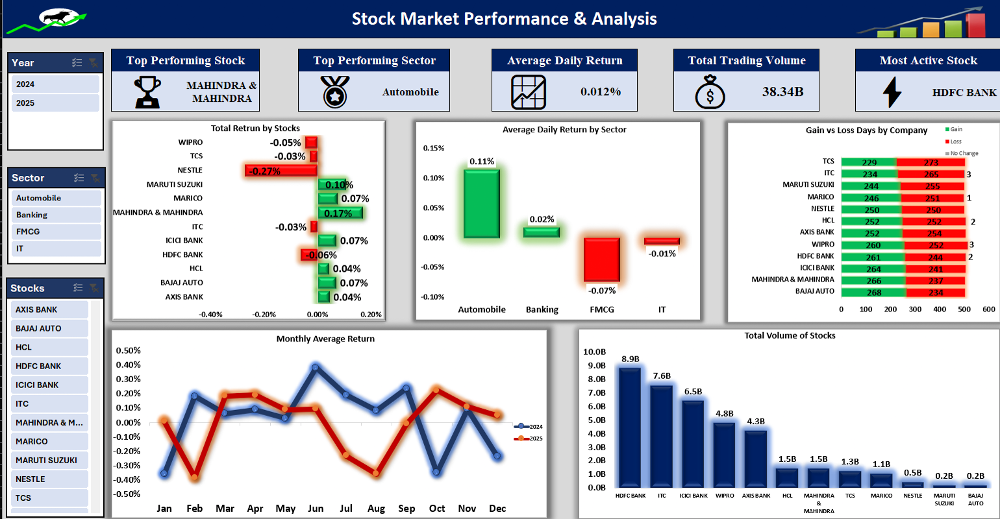
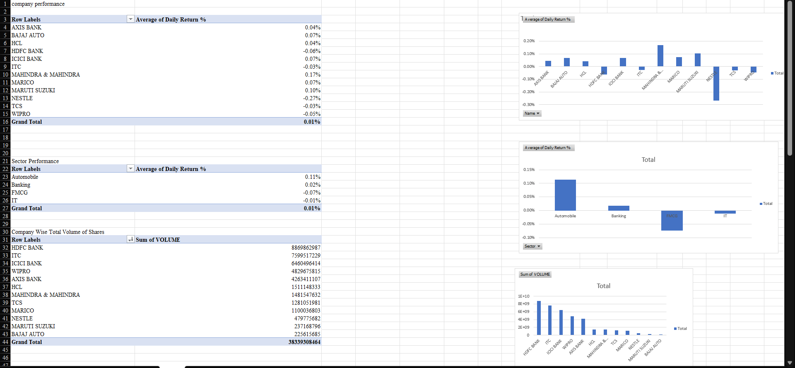
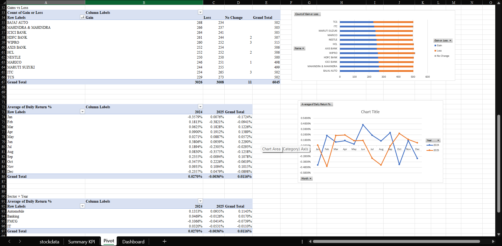

# 📊 Excel Stock Market Analysis Dashboard

## 📌 Project Overview

An interactive Excel dashboard developed to analyze stock market performance across companies and sectors using historical market data.

The dashboard allows users to compare stock performance, trading activity, returns, and sector-level trends through interactive filters and visualizations.

## 🛠️ Tools & Techniques

- Microsoft Excel
- Pivot Tables
- Pivot Charts
- Slicers
- SUMIFS
- COUNTIFS
- AVERAGEIFS
- KPI calculations
- Data cleaning and analysis
- Interactive dashboards

## 📈 Key Metrics Analyzed

- Trading Volume
- Trading Value
- Daily Returns
- Gain/Loss
- Positive-Day Percentage
- Stock Performance
- Sector Performance
- Company-level performance

## 🎯 Business Questions

- Which companies have the highest trading activity?
- Which stocks have the highest positive-day percentage?
- How do different sectors perform?
- How does stock performance change over time?
- Which companies have the highest trading volume?
- How do companies compare within the same sector?

## 📊 Dashboard Preview

### Overall Dashboard

### Pivot Table Analysis 1

### Pivot Table Analysis 2

## 🔍 Key Skills Demonstrated

- Data cleaning and organization
- Excel-based data analysis
- KPI development
- Pivot Table analysis
- Interactive dashboard creation
- Data visualization
- Trend and performance analysis

## 📁 Project File

The complete Excel dashboard is available in this repository:

**Stock_Market_Analysis_Dashboard.xlsx**

## 👩‍💻 Author

**Niyati Chavan**

Aspiring Data Analyst | Business Analyst

**Skills:** Excel | SQL | Power BI | Python
